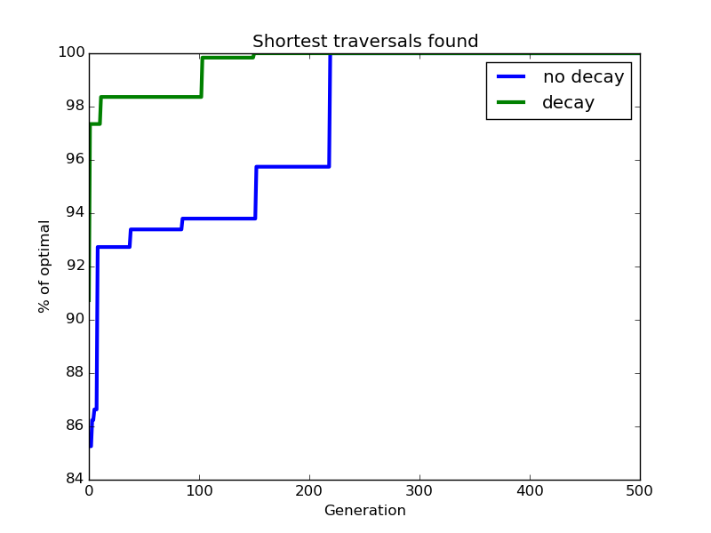

# Evolutionary Ants

#### Dan Bishop, Joey Maalouf, Joe Sutker

### Abstract

In this project, we use agent-based modeling to simulate the behaviour of ant colonies (specifically, how the ants think and act individually, but end up working together to achieve goals). We explore how simple rules can produce complex, emergent behavior.

We look at how ants gather food for the colony, using some combination of particle swarm optimization (swarm behavior) and ant colony optimization (graph traversal) to see what sort of behaviors we can generate.

### Replicating Experiments

#### Travelling Sales-ant

The travelling salesman problem involves multiple nodes in a complete connected graph, with each node representing a unique destination. The goal of the agent in this system is to traverse every node once and end up back at the starting node without revisiting any node. Bonabeau solves this with ant colony optimization, a type of algorithm that weights edges based on overall traversal time and bases the decisions of future agents based on  those weights, similar to ants and pheromones in the real world. 

###### _Figure 1. Example of optimal path solution found by experiment. Figure courtesy of Bonabeau and Théraulaz._

### Experimental Analysis

#### Travelling Sales-ant

Question: How can we find the shortest route across all nodes in a graph without re-visiting a node, making use of the ant-colony optimization technique?

Methodology: We modeled the environment as a complete graph, and set the agents (ants) to start at one particular node. We gave them the ability to randomly choose a new (unvisited) node to travel to, weighted directly proportional to the pheromone strength between the two nodes and inversely proportional to the travel distance to the next node. When an ant  makes it back to the start after visiting every node, a pheromone trail is laid down along its path, with strength inversely proportional to the distance traveled. This leads to optimization towards the least distance traveled, since those routes will have the strongest pheromones. While choosing paths based on distance from the current node is normally greedy behavior, the pheromones have the potential to mitigate that by making up for the lower distance-appeal in nodes that are slightly further away by boosting their pheromone-appeal if they actually do lead to an overall shorted path.

Results: We were able to successfully find the same route presented in the paper whose experiment we replicated, which we assume to be the optimal route.

###### _Figure 2. Each new generation of ants experiences diminishing returns as the simulation continues, with the shortest found distance improving sharply initially, then more slowly later on._

###### _Figure 3. In order to optimize our model, we tested the reasonable range of parameter values for this model. These parameters are the population size, number of generations to run, and the weights to apply to the pheromone strength and distance traveled when making a weighted random decision._

Interpretation: This technique found the optimal path, but not necessarily on the first try. This sort of approach can find a good solution very quickly, but may not find the optimal solution for a long time. This problem of not always being able to find the right solution makes this model less reliable than deterministic algorithms, which will always either find the answer or not.

##### Decaying Travelling Sales-ant

Question: What would happen if the pheromones in our TSA problem decayed over time?

Methodology: We created a modified version of the experiment described above, where the pheromones decreased across iterations. With every new generation of ants, the pheromone strength of each edge in the graph decreases by some set decay amount.

Results: This solution was also able to find the optimal solution after a few trials, and it seemed to have a slightly easier time doing so, taking fewer iterations to reach the best route.

We can see the effects of including pheromone decay in our model by comparing its results directly to those of the non-decaying model:

###### _Figure 4. Modifying our model to add pheromone decay makes it approach the optimal solution more rapidly and reach it earlier._

Interpretation: This modification seems to positively impact our algorithm, since ants don't get misled by outdated paths, while the good paths are constantly refreshed.

#### Shortest Path To Food

Question: What is the shortest path between 2 nodes in a graph?

Methodology: We modeled the environment as a single source node connected to many nodes, some of which were connected to a singular food node. Agents started at the source node and progressed along edges randomly with a bias for edges with pheromones, until they reached a food node. Upon finding food, ants returned to the source, laying pheromones as they went. After many generations, the shortest path from the source node to the food node should have the most pheromones.

Results: This algorithm had varying success rates in finding the shortest path between the hive node and food node depending on how long the simulation was run for.

###### _Figure 5. Running the simulation for a short time provides a reasonable increase in accuracy, and running the simulation for longer provides diminshing returns. The accuracy exceeds 75% within 200 steps and approaches 87% in longer simulations._

###### _Figure 6. The effectiveness of the solution varied based on pheromone strength, pheromone decay rate, and pheromone weight on agent pathfinding decisions. We found that lower amounts of pheromone decay yielded the most accurate simulation results. At decay rates above 0.04 pheromones per step, the accuracy of the results dropped significantly._

###### _Figure 7. Varying the base edge weight in ant decision making seemed to have little effect on the accuracy of the simulation as a whole._

###### _Figure 8. Increasing the pheromone strength yielded a reduced accuracy with high strength pheromones._

###### _Figure 9. Testing different combinations of pheromone strength and edge weights, we found that very strong pheromones would decrease the accuracy of the results slightly for all edge weights, while weaker pheromones performed very similarly to each other._

Interpretation: This algorithm is less efficient than something like Dijkstra's, but does provide an example of agent based modelling solving a traditional and well known problem. Theoretically, running the simulation repeatedly for a short time and then selecting the "best" answer from the different runs could provide a good estimation or perfect solution since about 25% of simulations were able to find the optimal solution within just a few time steps. In this situation, leveraging parallel processing could provide an improvement over other algorithms.

### Future Work

A possible extension of the shortest-path food-finding experiment is to assign each agent a carrying capacity and each node an amount of food, as well as to remove the restriction on only visiting a node once. When the agent can't carry more food, it returns home to drop it off and collects again. We expect to see some sort of emergent behaviour regarding food site choice, based on the rules that we choose to govern the sites such as the inability to revisit a node or the rate at which food could regenerate.

See [`proposed_changes.md`](proposed_changes.md) for our ideas for further avenues of exploration. All of these potential ideas are additions for our existing models.

### Annotated Bibliography

[P.J. Deadman; "Modelling individual behaviour and group performance in an intelligent agent-based simulation of the tragedy of the commons." Journal of Environmental Management (1999) 56, 159–172.](http://www.sciencedirect.com/science/article/pii/S0301479799902724)

This paper investigates the use of agent-based modelling to simulate behaviour of agents sharing a common resource. In particular, the authors investigated the causes of "tragedy of the commons" situations, where the best thing for each individual agent leads to the downfall of the group as a whole.

[Eric Bonabeau, Marco Dorigo and Guy Théraulaz; "Swarm Intelligence: From Natural to Artificial Systems". New York, NY: Oxford University Press, Santa Fe Institute Studies in the Sciences of Complexity (1999), Paper: ISBN 0-19-513159-2.](http://dlia.ir/Scientific/e_book/Science/Cybernetics/006285.pdf)

This book summarizes the different approaches to swarm intelligence, and how these different methods could be used to model more complex systems in real life. It details how emergent behavior and autonomy could result from these sorts of networks, allowing systems to become intelligent by giving functionality to distributed agents rather than some sort of centralized control.

[Eric Bonabeau and Guy Théraulaz; "Swarm Smarts". Scientific American (2008)](https://svn-d1.mpi-inf.mpg.de/AG1/MultiCoreLab/papers/scientificamericanSwarmIntelligence.pdf)

This source discusses ant colony optimization, a graph-traversal optimization technique that uses agent-based modeling to mimic the pheromone-laying behavior that enables ants to explore different routes and follow the most optimal one found. The paper uses this technique to solve the [Travelling Salesman Problem](https://en.wikipedia.org/wiki/Travelling_salesman_problem), using American cities as points of interest. The results of this experiment are outlined within the paper, and they serve as a suitable baseline for further exploration.
