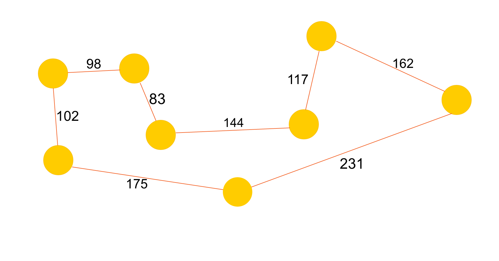

# Evolutionary Ants

#### Dan, Joey, Joe

### Abstract

We will be using agent-based modeling to simulate the behaviour of ant colonies (specifically, how the ants think and act individually, but end up working together to achieve goals). We want to explore how simple rules can produce complex, emergent behavior.

We plan to look at how ants gather food for the colony, using some combination of particle swarm optimization (swarm behavior) and ant colony optimization (graph traversal) to see what sort of behaviors we can generate. We also plan to explore a 2D-space model, in addition to a simple graph structure.

### Annotated Bibliography

[P.J. Deadman; "Modelling individual behaviour and group performance in an intelligent agent-based simulation of the tragedy of the commons." Journal of Environmental Management (1999) 56, 159–172.](http://www.sciencedirect.com/science/article/pii/S0301479799902724)

This paper investigates the use of agent-based modelling to simulate behaviour of agents sharing a common resource. In particular, the authors investigated the causes of "tragedy of the commons" situations, where the best thing for each individual agent leads to the downfall of the group as a whole.

[Eric Bonabeau, Marco Dorigo and Guy Theraulaz; "Swarm Intelligence: From Natural to Artificial Systems". New York, NY: Oxford University Press, Santa Fe Institute Studies in the Sciences of Complexity (1999), Paper: ISBN 0-19-513159-2.](http://dlia.ir/Scientific/e_book/Science/Cybernetics/006285.pdf)

This book summarizes the different approaches to swarm intelligence, and how these different methods could be used to model more complex systems in real life. It details how emergent behavior and autonomy could result from these sorts of networks, allowing systems to become intelligent by giving functionality to distributed agents rather than some sort of centralized control.

[Eric Bonabeau and Guy Theraulaz; "Swarm Smarts". Scientific American (2008)](https://svn-d1.mpi-inf.mpg.de/AG1/MultiCoreLab/papers/scientificamericanSwarmIntelligence.pdf)

This source discusses ant colony optimization, a graph-traversal optimization technique that uses agent-based modeling to mimic the pheromone-laying behavior that enables ants to explore different routes and follow the most optimal one found. The paper uses this technique to solve the [Travelling Salesman Problem](https://en.wikipedia.org/wiki/Travelling_salesman_problem), using American cities as points of interest. The results of this experiment are outlined within the paper, and they serve as a suitable baseline for further exploration.

### Replicating Experiments

#### Travelling Sales-ant

The travelling salesman problem involves multiple nodes in a complete connected graph, with each node representing a unique destination. The goal of the agent in this system is to traverse every node once and end up back at the starting node without revisiting any node. Bonabeau solves this with ant colony optimization, a type of algorithm that weights edges based on overall traversal time and bases the decisions of future agents based on  those weights, similar to ants and pheromones in the real world. 

A possible extension of this experiment would be to assign each agent a carrying capacity and each node an amount of food. We would also remove the restriction on only visiting a node once. When the agent can't carry more food, it returns home to drop it off and collects again. We expect to see some sort of emergent behaviour regarding food site choice, based on the rules that we choose to govern the sites such as the inability to revisit a node or the rate at which food could regenerate.

Example of optimal path solution found by experiment. Pictured are food nodes with weighted edges. The weight is determined by the agents traversing the edge.

See [`proposed_changes.md`](proposed_changes.md) for our ideas for further avenues of exploration.

### Experimental Analysis

##### Travelling Sales-ant

Question: How can we find the shortest route across all nodes in a graph without re-visiting a node, making use of the ant-colony optimization technique?

Methodology: We modeled the environment as a complete graph, and set the agents (ants) to start at one particular node. We gave them the ability to randomly choose a new (unvisited) node to travel to, weighted based on pheromone trails and travel distance. When an ant  makes it back to the start after visiting every node, a pheromone trail is laid down along its path, with strength inversely proportional to the distance traveled. This leads to optimization towards the least distance traveled, since those routes will have the strongest pheromones.

Results: We were able to successfully find the same route presented in the paper whose experiment we replicated.

Interpretation: This technique was able to get the results we wanted, even if it took a few tries to do so. It falls short compared to deterministic algorithms, which will always either find the answer or not; this sort of approach can find a good solution very quickly, but may not find the optimal solution for a long time.

##### Decaying Travelling Sales-ant

Question: What would happen if the pheromones in our TSA problem decayed over time?

Methodology: We created a modified version of the experiment described above, where the pheromones decreased across iterations.

Results: This solution was also able to find the optimal solution after a few trials, and it seemed to have a slightly easier time doing so, taking fewer iterations to reach the best route.

Interpretation: This modification seems to positively impact our algorithm, since ants don't get misled by outdated paths, while the good paths are constantly refreshed.

##### Shortest Path To Food

Question: What is the shortest path between 2 nodes in a graph?

Methodology: We modeled the environment as a single source node connected to many generic nodes, some of which were connected to a singular food node. Agents started at the source node and progressed along edges randomly with a bias for edges with pheromones, until they reached a food node. Upon finding food, ants returned to teh source, laying pheromones as they went. After many generations, the shortest path from the source node to the food node should have the most pheromones.

Results: This algorithm was able to find the shortest path between the two nodes after several generations. Increasing the number of ants decreased the number of generations needed to solve the problem slightly.

Interpretation: This algorithm is less efficient than something like Dijkstra's, but does provide an example of agent based modelling solving a traditional and well known problem. 

### Future Experiments

For our next experiment, we will be representing the environment as a 2D grid. This allows us to implement more complex behaviours such as random wandering, colony creation, and path intersection. For results, we may see the ants optimize the location of their colony for distance from food. The results will be interpreted from the final state of the simulation after a certain number of iterations.

### Learning Goals

Dan:

I wanted to learn about evolution algorithms and maybe some swarm behaviour in there too. This project involves evolution algorithms and could also have some swarming stuff if we break out of the confines of the graphical model of space and go to a 2 or 3 dimensional space. This project will help me learn about how to apply evolutionary algorithms to agent based modelling.

Joey:

My goals for this project are to learn more about evolutionary algorithms, as well as to explore any interesting emergent behavior and assosciated properties. Because this project involves modifying an existing experiment, we have the opportunity to see how our agents' behavior evolves according to the rules changes we make.

Joe:

I'd like to learn about both evolutionary models and emergent behavior, though one or the other would be fine. I'd also like to do something that's fun to talk about, since I will probably want to talk to a lot of people about it.
