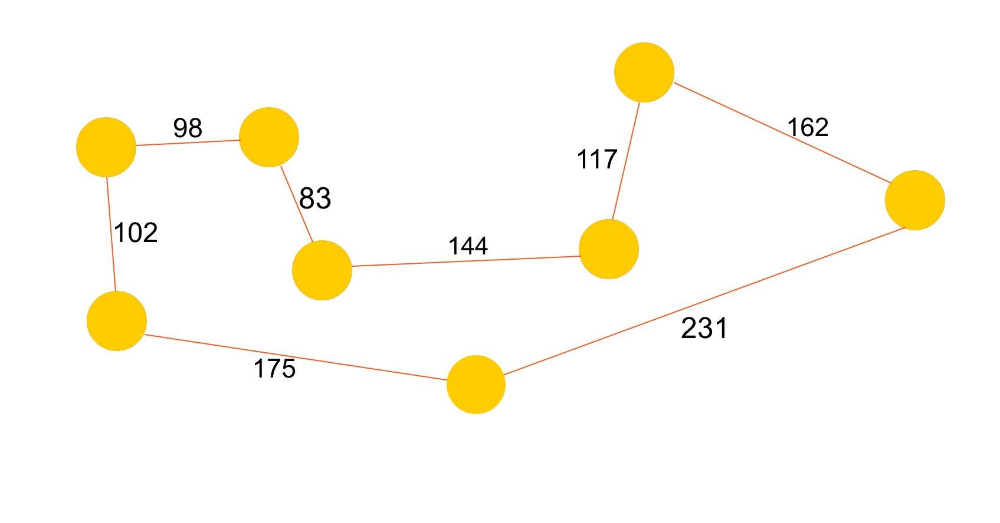

# Evolutionary Ants

#### Dan, Joey, Joe

### Abstract

We will be using agent-based modeling to simulate the behaviour of ant colonies (specifically, how the ants think and act individually, but end up working together to achieve goals). We want to explore how simple rules can produce complex, emergent behavior.

We plan to look at how ants gather food for the colony, using some combination of particle swarm optimization (swarm behavior) and ant colony optimization (graph traversal) to see what sort of behaviors we can generate.

### Annotated Bibliography

P.J. Deadman; "Modelling individual behaviour and group performance in an intelligent agent-based simulation of the tragedy of the commons." Journal of Environmental Management (1999) 56, 159–172.

This paper investigates the use of agent-based modelling to simulate behaviour of agents sharing a common resource. In particular, the authors investigated the causes of "tragedy of the commons" situations, where the best thing for each individual agent leads to the downfall of the group as a whole.

[source](http://www.sciencedirect.com/science/article/pii/S0301479799902724)

Eric Bonabeau, Marco Dorigo and Guy Theraulaz; "Swarm Intelligence: From Natural to Artificial Systems". New York, NY: Oxford University Press, Santa Fe Institute Studies in the Sciences of Complexity (1999), Paper: ISBN 0-19-513159-2.

[source](http://dlia.ir/Scientific/e_book/Science/Cybernetics/006285.pdf)

????

[source](https://svn-d1.mpi-inf.mpg.de/AG1/MultiCoreLab/papers/scientificamericanSwarmIntelligence.pdf)

### Replicating Experiments

#### Travelling Sales-ant

The travelling salesman problem involves multiple nodes in a complete connected graph, with each node representing a unique destination. The goal of the agent in this system is to traverse every node once and end up back at the starting node without revisiting any node. Bonabeau solves this with ant colony optimization, a type of algorithm that weights edges based on overall traversal time and bases the decisions of future agents based on  those weights, similar to ants and pheromones in the real world. 

A possible extension of this experiment would be to assign each agent a carrying capacity and each node an amount of food. We would also remove the restriction on only visiting a node once. When the agent can't carry more food, it returns home to drop it off and collects again. We expect to see some sort of emergent behaviour regarding food site choice, based on the rules that we choose to govern the sites such as the inability to revisit a node or the rate at which food could regenerate.

Example of optimal path solution found by experiment. Pictured are food nodes with weighted edges. The weight is determined by the agents traversing the edge.

### Learning Goals

Dan:

I wanted to learn about evolution algorithms and maybe some swarm behaviour in there too. This project involves evolution algorithms and could also have some swarming stuff if we break out of the confines of the graphical model of space and go to a 2 or 3 dimensional space. This project will help me learn about how to apply evolutionary algorithms to agent based modelling.

Joey:

My goals for this project are to learn more about evolutionary algorithms, as well as to explore any interesting emergent behavior and assosciated properties. Because this project involves modifying an existing experiment, we have the opportunity to see how our agents' behavior evolves according to the rules changes we make.

Joe:

I'd like to learn about both evolutionary models and emergent behavior, though one or the other would be fine. I'd also like to do something that's fun to talk about, since I will probably want to talk to a lot of people about it.
